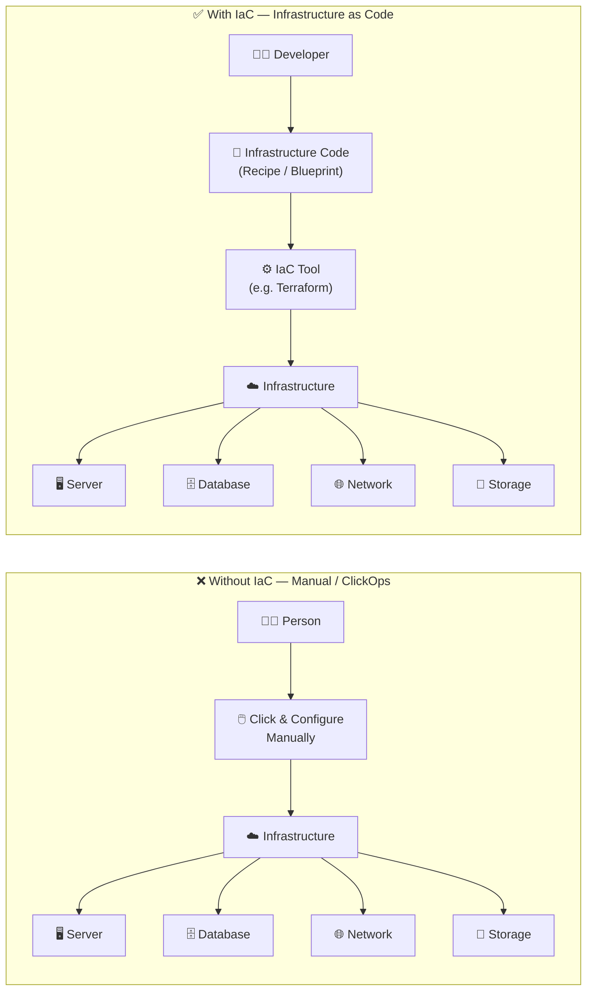
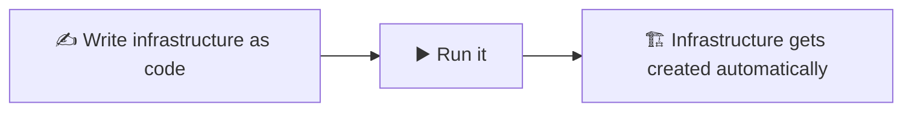

# Infrastructure as Code (IaC)

:::info[What you'll learn]
- What Infrastructure as Code (IaC) actually means
- Why IaC isn't limited to the cloud
- Why teams need IaC instead of manual setup
- What "ClickOps" is, and how it compares to IaC
- Popular IaC tools and which one to start with
- Why Terraform is a common first choice
:::

## What is Infrastructure as Code?

**Infrastructure as Code (IaC)** means creating and managing servers, databases, networks, and cloud resources using **code** instead of setting them up manually.

For example, instead of going to AWS and manually creating a server by clicking through many screens, you write a configuration file that says *"create this server with these settings."* The code can then recreate the same setup automatically, every time it's run.

:::tip[In simple words]
IaC is like having a **blueprint** for your entire IT infrastructure that a computer can build for you automatically.
:::

---

## Is IaC limited to the cloud?

**No — IaC is not limited to the cloud.**

Infrastructure as Code can be used to manage:

| Category | Examples |
|---|---|
| ☁️ **Cloud infrastructure** | AWS, Azure, GCP |
| 🖥️ **On-premise servers** | Servers in a company's own data center |
| 🌐 **Networks** | Routers, firewalls, load balancers, etc. |
| 🗄️ **Databases** | Database instances and configurations |
| 📦 **Containers / Kubernetes** | Clusters and related resources |

> **Simple definition:** Infrastructure as Code (IaC) is the practice of defining and managing IT infrastructure using code instead of manually configuring it. The cloud is just one of the most common places where IaC is used.

---

## Why do we need IaC?

Setting up servers, databases, networks, and other infrastructure manually can take a lot of time — and lead to mistakes.

Think of IaC like a **recipe** 🍳. Instead of explaining how to prepare a dish every single time, you write down the ingredients and steps once. Anyone can follow the recipe and get the same result.

In the same way, IaC lets you write your infrastructure setup as code, then use that code to automatically create and configure everything you need.

:::tip[In simple words]
IaC saves time, reduces human error, and makes infrastructure setup **easy, repeatable, and consistent**.
:::

---

## What is ClickOps?

**ClickOps** means managing infrastructure by manually clicking buttons and filling out forms in a tool's UI — instead of using code.

For example, in AWS you might:

1. 👆 Click **Create EC2 Instance**
2. 👆 Choose the operating system
3. 👆 Select CPU / RAM
4. 👆 Configure the network
5. 👆 Click **Create**

That's ClickOps.

### ClickOps vs. IaC

| | ClickOps | IaC |
|---|---|---|
| **Approach** | "I manually click and configure everything." | "I write the configuration as code, and the computer creates it for me." |
| **Best for** | Quick, one-off, manual tasks | Infrastructure that needs to be consistent, repeatable, and managed at scale |

---

## Visualizing the difference

> Without IaC, infrastructure is created and configured manually. With IaC, it's defined in code and built automatically and consistently by a tool.

---

## Popular IaC Tools

| Tool | Main Use |
|---|---|
| **Terraform** | Create and manage infrastructure across AWS, Azure, GCP, and more |
| **AWS CloudFormation** | Manage AWS infrastructure using AWS-native templates |
| **Azure Bicep** | Define and manage Azure infrastructure |
| **Google Cloud Deployment Manager** | Infrastructure management for Google Cloud |
| **Pulumi** | IaC using familiar programming languages (Python, TypeScript, Go, etc.) |
| **Ansible** | Automate server configuration and application setup |
| **AWS CDK** | Define AWS infrastructure using programming languages |

:::note[For beginners]
If you're learning IaC from scratch, start with **Terraform** — it teaches the core IaC concepts and works across multiple cloud providers.
:::

---

## Why Terraform?

Terraform is popular because it makes infrastructure **automated, repeatable, predictable, and manageable through code**.

- 🌍 **Multi-cloud** — Manage AWS, Azure, GCP, Kubernetes, GitHub, and many other platforms with one tool
- 📝 **Infrastructure as Code** — Define infrastructure in code instead of creating it manually
- 🔄 **Repeatable** — Use the same code to recreate identical infrastructure whenever needed
- 🔍 **Preview changes** — `terraform plan` shows what will be created, modified, or deleted before anything is applied
- ⚙️ **Automatic dependency handling** — Terraform figures out the correct order to create or change resources
- 🧠 **Tracks infrastructure** — Terraform uses **state** to keep track of everything it manages
- 👥 **Team-friendly** — Store infrastructure code in Git, review changes, and collaborate as a team
- 🛠️ **Declarative** — You describe *what* you want; Terraform figures out *how* to achieve it
- 🚀 **Reduces manual work** — Less clicking in cloud consoles, fewer configuration mistakes

:::tip[In one line]
Terraform lets you define your infrastructure as code and consistently create, change, and manage it through automation.
:::

---

## Quick Recap

| Concept | Takeaway |
|---|---|
| **IaC** | Manage infrastructure using code, not manual clicks |
| **Scope** | Works for cloud, on-prem, networks, databases, and containers |
| **Why** | Saves time, reduces errors, ensures consistency |
| **ClickOps** | The manual alternative — fine for one-off tasks, not for scale |
| **Best starting tool** | Terraform |
---
