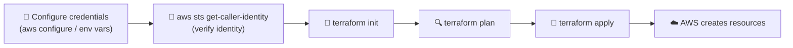

# Connecting Terraform to AWS

Before Terraform can create anything, it needs somewhere to send its instructions — and it needs to prove it's allowed to. This page covers what AWS is, how Terraform authenticates against it, and how to safely test your connection before running `terraform apply`.

:::info[What you'll learn]
- What AWS is and how Terraform talks to it
- What `aws sts get-caller-identity` does and why it matters
- How the HashiCorp Sandbox fakes AWS with LocalStack
- How to configure Terraform against a **real** AWS account, step by step
- How to safely use real AWS from inside the sandbox
- Key safety rules for your credentials
:::

---

## 1. What is AWS?

**AWS (Amazon Web Services)** is Amazon's cloud. Instead of buying your own computers, you rent them over the internet — servers, storage, databases, and more.

**Terraform is the tool that tells AWS what to create** — for example, *"make me one storage bucket."* Terraform itself doesn't own any infrastructure; it just sends instructions to AWS (or another provider) on your behalf. That's why, before Terraform can do anything, **it needs valid AWS credentials** — the same way you'd need a login to manage resources yourself in the AWS Console.

---

## 2. What is `aws sts get-caller-identity`?

It's a simple command that answers one question: **"Who am I logged in as right now?"**

```bash
aws sts get-caller-identity
```

It returns three things:

| Field | Meaning |
|---|---|
| `Account` | The AWS account number you are connected to |
| `UserId` | Your unique ID |
| `Arn` | Your full name/address inside AWS (which user or role you are) |

:::tip[Think of it like...]
Checking your ID badge before entering a building. It needs no special permissions, so it's the **safest first test** of any AWS setup.
:::

---

## 3. Why is it needed?

- ✅ **Proves you are connected.** If it shows your account, your setup works. If it fails, Terraform will fail too.
- 🛡️ **Stops mistakes.** You can confirm you're in the **right account** *before* creating or deleting anything.
- 🔗 **Terraform uses the same login.** Terraform finds your AWS credentials the exact same way the `aws` command does. If the command works, Terraform can work.

:::tip[Golden rule]
Always run `aws sts get-caller-identity` **before** `terraform apply`.
:::

---

## 4. How it works in the HashiCorp Sandbox lab

The sandbox does **not** use real AWS. It uses **LocalStack**, a fake "mini AWS" that runs inside the sandbox. It's set up for you in three ways:

1. 🐳 **LocalStack runs in Docker.** Check with `docker ps`.
2. 🔀 **The `aws` command is aliased to `awslocal`.** So `aws` talks to LocalStack, not real AWS.
3. 📄 **A file named `localstack_overrides.tf` is included.** It points Terraform to LocalStack automatically.

You do **not** need an AWS account, keys, or any setup. Nothing costs money.

**Try it in the sandbox:**

```bash
aws sts get-caller-identity
```

LocalStack normally shows a fake account number made of zeros (like `000000000000`). Run it yourself and see — this is **not** a real AWS account.

---

## 5. How to configure real AWS (step by step)

:::caution[Real AWS can cost money]
Always run `terraform destroy` when you finish practicing on a real account.
:::

### Step 1: Create an AWS account
Go to [aws.amazon.com](https://aws.amazon.com) and sign up. You'll need an email and a payment card.

### Step 2: Create an IAM user (never use your root account)

1. Sign in to the AWS Console and search for **IAM**.
2. Click **Users**, then **Create user**.
3. Give it a name (for example `terraform-user`).
4. Give it permissions. For learning, attach a policy that allows what you need — for example `AmazonS3FullAccess` for the bucket example.

### Step 3: Create an access key

1. Open the user you created, then the **Security credentials** tab.
2. Click **Create access key** and choose **Command Line Interface (CLI)**.
3. Copy the **Access Key ID** and **Secret Access Key**. The secret is shown only once, so save it somewhere safe.

### Step 4: Install the AWS CLI on your computer

**Windows (PowerShell):**

```powershell
winget install Amazon.AWSCLI
```

**macOS (Terminal):**

```bash
brew install awscli
```

Close and reopen your terminal, then check:

```bash
aws --version
```

### Step 5: Connect the CLI to your account

```bash
aws configure
```

It asks four questions:

| Question | What to enter |
|---|---|
| AWS Access Key ID | The key ID from Step 3 |
| AWS Secret Access Key | The secret from Step 3 |
| Default region name | For example `us-east-1` |
| Default output format | `json` |

### Step 6: Test it

```bash
aws sts get-caller-identity
```

You should see your **real** account number and user name. This means you're connected.

### Step 7: Use Terraform

This is the payoff — **Terraform automatically uses the same credentials** you just configured. There's no separate Terraform login step. Once `aws sts get-caller-identity` works, `terraform init`, `terraform plan`, and `terraform apply` will all work against your real AWS account, using the `aws` provider block, for example:

```hcl
provider "aws" {
  region = "us-east-1"
}

resource "aws_s3_bucket" "demo" {
  bucket = "my-first-terraform-bucket"
}
```

No `access_key` or `secret_key` needs to be written in the code — Terraform picks up the credentials you configured with `aws configure`.

---

## 6. Using real AWS inside the sandbox (optional, advanced)

The sandbox can also deploy to real AWS. Do this only when you're comfortable:

**Step 1 — Remove the LocalStack override** so Terraform stops talking to the fake AWS:

```bash
rm localstack_overrides.tf
```

**Step 2 — Set your keys and region as environment variables:**

```bash
export AWS_ACCESS_KEY_ID="your-key-id"
export AWS_SECRET_ACCESS_KEY="your-secret-key"
export AWS_DEFAULT_REGION="us-east-1"
```

**Step 3 — Un-alias `aws`**, if it still points to LocalStack:

```bash
unalias aws
```

**Step 4 — Verify** with:

```bash
aws sts get-caller-identity
```

It should now show your **real** account.

:::danger[Always clean up]
Run `terraform destroy` **before leaving**. The sandbox does not clean up real resources for you.
:::

---

## 7. Safety rules for your keys

- 🚫 Never share your keys or paste them in chats, screenshots, or public code (like GitHub)
- 🚫 Never use your **root account** keys
- 🗑️ Delete keys you no longer use (IAM → your user → Security credentials)
- 👀 Watch your AWS bill and clean up with `terraform destroy`

---

## How this fits into the Terraform workflow



> Terraform never asks for credentials itself — it silently reuses whatever the AWS CLI is already configured with. That's exactly why `aws sts get-caller-identity` is the recommended sanity check before every `terraform apply`: if it shows the right account, Terraform will use that same account too.

---

## Quick Summary

| | HashiCorp Sandbox | Real AWS |
|---|---|---|
| AWS account needed? | No | Yes |
| Keys needed? | No | Yes |
| Costs money? | No | Possibly |
| `aws` command talks to | LocalStack (fake AWS) | Real AWS |
| Best for | Learning safely | Real projects |

:::tip[In one line]
`aws sts get-caller-identity` tells you *who* Terraform will act as — always check it before `terraform apply`, whether you're in the sandbox or on a real AWS account.
:::