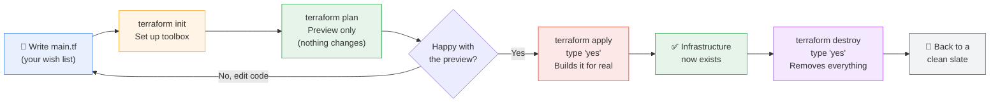

# Terraform Core Commands: init, plan, apply, destroy

A simple guide to the 4 commands you will use every single time you work with Terraform. Try these in your HashiCorp Sandbox or local system.

:::info[Before you begin]
This guide assumes you already have Terraform installed on your system with LocalStack or use a sandbox with LocalStack environment running. See the [Terraform Install Guide](./installation) if you haven't set that up yet.
:::

For the HashiCorp Sandbox, go to [developer.hashicorp.com/terraform/sandbox](https://developer.hashicorp.com/terraform/sandbox).

---

## The Big Picture (in one line each)

| Command | What it does | Simple way to think about it |
|---|---|---|
| `terraform init` | Sets up your project | Getting your toolbox ready |
| `terraform plan` | Shows what *will* happen | A preview, nothing changes yet |
| `terraform apply` | Actually builds it | Pressing "confirm" |
| `terraform destroy` | Removes what you built | Cleaning up |

You will almost always run them **in this order**: `init` → `plan` → `apply` → (later) `destroy`.

### The Flow, Visually



**How to read this:** you write your code once, then loop through `plan` and edits until the preview looks right, `apply` to build it for real, and `destroy` whenever you're done and want to clean up.

---

## Before you start: one file to write

All 4 commands work on top of a Terraform file that describes what you want. Create a file called `main.tf` and paste this in:

```hcl
resource "aws_s3_bucket" "demo" {
  bucket = "my-first-terraform-bucket"
}
```

**What does this mean, in plain words?**

- `resource` → "I want to create something."
- `"aws_s3_bucket"` → the *type* of thing (a storage bucket in AWS).
- `"demo"` → a nickname *you* choose, only used inside your Terraform files.
- `bucket = "..."` → the actual name of the bucket in AWS.

:::tip[Think of it like a shopping list]
Writing a `.tf` file is like writing down what you want to buy. You are not buying anything yet — you're just writing down what you want.
:::

---

## 1. `terraform init` — Set Up

### Why do we need it?

Terraform doesn't know how to talk to AWS (or Azure, Google Cloud, etc.) by itself. It needs small helper programs called **providers**. `init` downloads the correct provider for your code, and sets up a hidden folder to track everything.

:::tip[Think of it like installing an app]
You only need to fully reinstall if you add something new, but it's always safe to run again.
:::

### When do you run it?

- The very first time you work in a new folder.
- Any time you add a new provider or module to your code.

### Command

```bash
terraform init
```

### What you'll see

```
Initializing the backend...
Initializing provider plugins...
- Finding hashicorp/aws versions matching...
- Installing hashicorp/aws...

Terraform has been successfully initialized!
```

:::note
That last line is the one to look for. If you see it, you're ready for the next step.
:::

### Try it yourself

1. Create a folder and open a terminal in it.
2. Save the `main.tf` file from above inside it.
3. Run:
   ```bash
   terraform init
   ```
4. Check that a new hidden folder called `.terraform` was created:
   ```bash
   ls -la
   ```

---

## 2. `terraform plan` — Preview

### Why do we need it?

`plan` shows you **exactly what Terraform is about to do**, without actually doing it. This is your safety check before making real changes.

:::tip[Think of it like checking your online cart]
You see what will be added, changed, or removed before clicking "Buy" — nothing happens until you confirm.
:::

### When do you run it?

- After `init`, before `apply`.
- Any time after you edit your `.tf` files, to see what changed.
- As a habit, even if you're confident — it costs nothing and prevents mistakes.

### Command

```bash
terraform plan
```

### What you'll see

```
Terraform will perform the following actions:

  # aws_s3_bucket.demo will be created
  + resource "aws_s3_bucket" "demo" {
      + bucket = "my-first-terraform-bucket"
      + id     = (known after apply)
      ...
    }

Plan: 1 to add, 0 to change, 0 to destroy.
```

**How to read the symbols:**

| Symbol | Meaning |
|---|---|
| `+` | Will be **created** |
| `~` | Will be **changed** |
| `-` | Will be **destroyed / removed** |
| `-/+` | Will be **destroyed and recreated** |

:::info
The summary line at the bottom (`Plan: 1 to add, 0 to change, 0 to destroy`) is the quick answer — always read it before moving to `apply`.
:::

### Try it yourself

```bash
terraform plan
```

Look for `Plan: 1 to add, 0 to change, 0 to destroy.` — that confirms Terraform wants to create exactly one bucket, nothing else.

---

## 3. `terraform apply` — Deploy (Build It)

### Why do we need it?

This is the command that **actually creates, changes, or removes real infrastructure**. Everything before this step was just talk — `apply` is action.

:::tip[Think of it like clicking "Buy Now"]
After this step, the thing genuinely exists — this is action, not preview.
:::

### When do you run it?

- After you've reviewed the `plan` output and you're happy with it.
- Every time you want your real infrastructure to match your `.tf` files.

### Command

```bash
terraform apply
```

Terraform will show you the same preview as `plan`, then ask:

```
Do you want to perform these actions?
  Terraform will perform the actions described above.
  Only 'yes' will be accepted to approve.

  Enter a value:
```

Type `yes` and press Enter.

### What you'll see

```
aws_s3_bucket.demo: Creating...
aws_s3_bucket.demo: Creation complete after 2s [id=my-first-terraform-bucket]

Apply complete! Resources: 1 added, 0 changed, 0 destroyed.
```

:::note
`Apply complete!` means it worked. Your bucket now really exists (in the sandbox, inside LocalStack).
:::

### Skip the confirmation (use carefully)

For quick sandbox practice only, you can skip the "type yes" prompt:

```bash
terraform apply -auto-approve
```

:::warning
Avoid `-auto-approve` in real projects. The confirmation step exists to stop accidental changes to real infrastructure.
:::

### Try it yourself

```bash
terraform apply
```

Type `yes`. Then confirm your bucket exists:

```bash
aws s3 ls
```

You should see `my-first-terraform-bucket` in the list.

---

## 4. `terraform destroy` — Clean Up

### Why do we need it?

`destroy` removes everything Terraform created. This matters because **leftover infrastructure can cost money or cause confusion**, even in real AWS accounts. Cleaning up is a healthy habit.

:::tip[Think of it like returning something you bought]
Everything is undone, and you're back to where you started.
:::

### When do you run it?

- When you're done practicing.
- When you want a clean slate to start over.
- Always in real AWS, once you no longer need something, to avoid ongoing charges.

:::danger
In real AWS, `destroy` permanently deletes resources — there's no undo. Always read the preview carefully before typing `yes`. In the sandbox with LocalStack, it's completely safe to practice.
:::

### Command

```bash
terraform destroy
```

Just like `apply`, it shows a preview first and asks for confirmation:

```
Plan: 0 to add, 0 to change, 1 to destroy.

Do you really want to destroy all resources?
  Enter a value:
```

Type `yes` and press Enter.

### What you'll see

```
aws_s3_bucket.demo: Destroying... [id=my-first-terraform-bucket]
aws_s3_bucket.demo: Destruction complete after 1s

Destroy complete! Resources: 0 added, 0 changed, 1 destroyed.
```

### Try it yourself

```bash
terraform destroy
```

Type `yes`, then confirm the bucket is gone:

```bash
aws s3 ls
```

The list should now be empty.

---

## Small Practice Script (copy-paste all at once)

:::tip[Try this in your sandbox]
Run these one command at a time (not all at once) so you can watch what each step actually does.
:::

```bash
# Step 1: Write the code
cat > main.tf <<'EOF'
resource "aws_s3_bucket" "demo" {
  bucket = "my-first-terraform-bucket"
}
EOF

# Step 2: Set up the project
terraform init

# Step 3: Preview the plan
terraform plan

# Step 4: Build it
terraform apply

# Step 5: Check it exists
aws s3 ls

# Step 6: Clean up
terraform destroy
```

---

## A Slightly Bigger Example: Two Resources

Once the single-bucket example feels easy, try this. It creates **two** buckets, so you can see `plan` and `apply` handle multiple resources.

```hcl
resource "aws_s3_bucket" "website" {
  bucket = "my-practice-website-bucket"
}

resource "aws_s3_bucket" "backup" {
  bucket = "my-practice-backup-bucket"
}
```

Run the same 3 steps:

```bash
terraform init
terraform plan     # should say: Plan: 2 to add, 0 to change, 0 to destroy.
terraform apply    # type yes
```

Then try changing one bucket's name in the file and run `terraform plan` again. You'll see Terraform detect the change:

```
  # aws_s3_bucket.website must be replaced
-/+ resource "aws_s3_bucket" "website" {
      ~ bucket = "my-practice-website-bucket" -> "my-renamed-bucket" # forces replacement
```

This shows Terraform's real power: it always compares your code to what actually exists, and tells you exactly what needs to change.

Clean up when done:

```bash
terraform destroy
```

---

## Quick Reference

```bash
terraform init       # Step 1: set up (run once, or after adding providers)
terraform plan        # Step 2: preview (safe, changes nothing)
terraform apply        # Step 3: build (asks for "yes" confirmation)
terraform destroy       # Step 4: remove everything (asks for "yes" confirmation)
```

## Cheat Sheet: Which One Do I Need?

| I want to... | Run this |
|---|---|
| Start a brand-new Terraform project | `terraform init` |
| See what my code *would* do, without changing anything | `terraform plan` |
| Actually create or update my infrastructure | `terraform apply` |
| Remove everything I built | `terraform destroy` |
| Check my code changed something before applying | `terraform plan` again |

---

## Common Beginner Questions

**Do I have to type `yes` every time?**
Yes, for `apply` and `destroy` — that's intentional, so you don't change real infrastructure by accident.

**What if I run `apply` without running `plan` first?**
It still works — `apply` shows you the same preview before asking for confirmation. Running `plan` separately is just good practice for double-checking.

**What if I run `apply` again after it already succeeded?**
Terraform compares your code to what already exists. If nothing changed, it will say:
```
No changes. Your infrastructure matches the configuration.
```

**Is `destroy` permanent?**
Yes, in real AWS — see the warning above. In this sandbox with LocalStack, it's safe practice with no real cost.