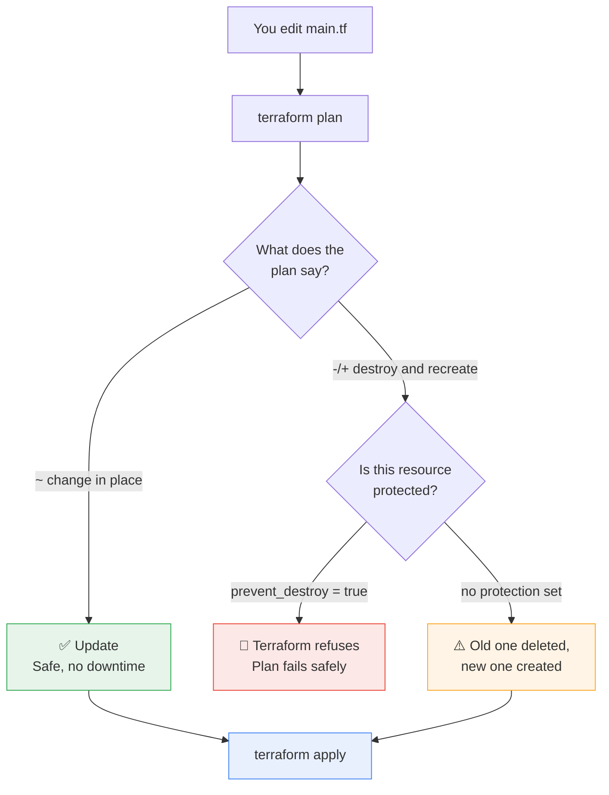
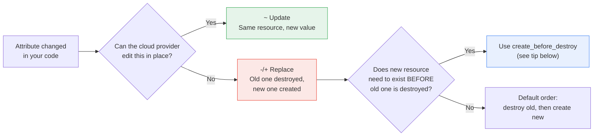
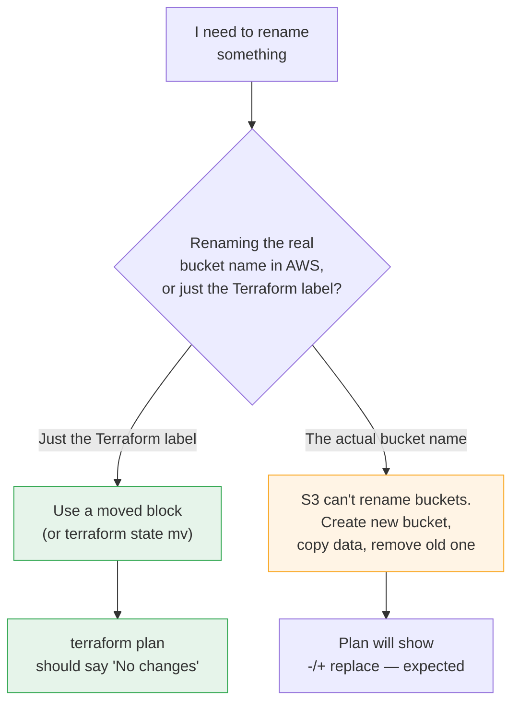

# Terraform Safety Nets: Tags, prevent_destroy, Replace vs Update, Renaming

:::info[Continuing from the last guide]
This page picks up where **[Terraform Core Commands: init, plan, apply, destroy](./terraform-core-commands)** left off. If you haven't gone through `init`, `plan`, `apply`, and `destroy` yet, start there first — everything below builds on those four commands.
:::

In the last guide you learned the 4 commands you always run. In this guide you'll learn 4 things that keep you **safe** while you run them:

| Topic | In one line |
|---|---|
| **Tags** | Labels you stick on resources, so you know who/what/why later |
| **`prevent_destroy`** | A lock that stops Terraform from ever deleting something important |
| **Replace vs Update** | Why some changes are gentle, and some tear the resource down and rebuild it |
| **Renaming safely** | How to rename things without Terraform destroying and recreating them |

---

## The Big Picture, Visually



**How to read this:** every change you make lands in one of two buckets — a gentle **update**, or a **replace** (destroy + recreate). `prevent_destroy` is the only thing standing between a risky replace and an actual accident.

---

## 1. Tags — Labeling Your Resources

### Why do we need them?

In real AWS accounts, you'll eventually have hundreds of resources. Tags are just **key–value labels** you attach, so you (or your team, or your billing dashboard) can answer questions like "whose bucket is this?" or "which environment is this for?"

:::tip[Think of it like a sticky note]
A tag is a sticky note on a box in a warehouse: `Owner: Priya`, `Env: dev`, `Project: onboarding`. The box works fine without the note — but good luck finding it again in six months without one.
:::

### Command / Syntax

Tags go straight inside your resource block:

```hcl
resource "aws_s3_bucket" "demo" {
  bucket = "my-first-terraform-bucket"

  tags = {
    Environment = "sandbox"
    Owner       = "your-name"
    Project     = "terraform-practice"
  }
}
```

### What you'll see in `terraform plan`

```
  # aws_s3_bucket.demo will be created
  + resource "aws_s3_bucket" "demo" {
      + bucket = "my-first-terraform-bucket"
      + tags   = {
          + "Environment" = "sandbox"
          + "Owner"       = "your-name"
          + "Project"     = "terraform-practice"
        }
    }
```

:::note
Notice tags show up with a plain `+` (added) or `~` (changed) — never `-/+`. Changing a tag is one of the gentlest changes you can make. More on why in Section 3.
:::

### Avoid repeating yourself: `default_tags`

If every resource in your project needs the same tags (like `Environment` or `Owner`), set them once on the **provider** instead of retyping them everywhere:

```hcl
provider "aws" {
  region = "us-east-1"

  default_tags {
    tags = {
      Environment = "sandbox"
      ManagedBy   = "terraform"
    }
  }
}
```

:::tip
`default_tags` are automatically merged into every resource's own tags. You only add resource-specific tags (like `Project`) on the resource itself.
:::

### Try it yourself

1. Add the `tags` block to the `main.tf` from the previous guide.
2. Run `terraform plan` — check the tags appear with a `+`.
3. Run `terraform apply`, then change the `Owner` value and run `terraform plan` again.
4. Confirm it shows `~` (update), not `-/+` (replace).

---

## 2. `prevent_destroy` — The "Don't You Dare" Lock

### Why do we need it?

Some resources are too important to lose by accident — a production database, a bucket full of customer files, a state-storage bucket. `prevent_destroy` tells Terraform: **"Refuse to destroy this, even if someone runs `destroy` or changes the code in a way that would delete it."**

:::warning
`prevent_destroy` does not stop humans from deleting the resource manually in the AWS Console. It only stops **Terraform** from doing it.
:::

### Command / Syntax

You add a `lifecycle` block inside the resource:

```hcl
resource "aws_s3_bucket" "important_data" {
  bucket = "my-companys-critical-bucket"

  lifecycle {
    prevent_destroy = true
  }
}
```

### What happens if you try to destroy it anyway

```bash
terraform destroy
```

```
│ Error: Instance cannot be destroyed
│
│   on main.tf line 1:
│    1: resource "aws_s3_bucket" "important_data" {
│
│ Resource aws_s3_bucket.important_data has lifecycle.prevent_destroy
│ set, but the plan calls for this resource to be destroyed.
```

:::danger
This is Terraform working correctly, not a bug! It stopped a deletion on purpose. To actually remove this resource later, you have to deliberately remove the `prevent_destroy` line first, then run `destroy` again — a two-step process on purpose.
:::

### When should you use it?

| Use it for | Skip it for |
|---|---|
| Production databases | Your sandbox practice bucket |
| State-storage buckets | Temporary test resources |
| Anything with real customer data | Anything you rebuild daily |

### Try it yourself (safe in the sandbox)

```bash
# Add lifecycle { prevent_destroy = true } to your bucket, then:
terraform apply         # type yes

terraform destroy       # this should now FAIL — that's the point!

# To actually clean up your sandbox afterward, remove the
# lifecycle block, then run terraform destroy again.
```

---

## 3. Replace vs. Update — Why Terraform Sometimes Rebuilds Everything

### Why does this happen?

Every attribute on a resource is either:
- **Mutable** — AWS can change it on the fly (like a tag, or a description).
- **Immutable** — AWS has no "edit" button for it. The only way to change it is to delete the old one and create a new one.

Terraform knows which is which for every resource type, and shows you the difference **before** it touches anything.

:::tip[Think of it like a house]
Repainting a wall (mutable) doesn't require rebuilding the house. Moving the foundation (immutable) does — you'd have to tear it down and build a new one on the new spot.
:::

### The 3 symbols, side by side

| Symbol | Meaning | Example |
|---|---|---|
| `~` | **Update in place** — no downtime | Changing a `tags` value |
| `-/+` | **Replace** — destroy, then create | Changing an S3 bucket's `bucket` name |
| `-` then `+` (separately) | Destroy one resource, create an unrelated one | Deleting a resource block entirely |

### See it for yourself

Start with:

```hcl
resource "aws_s3_bucket" "demo" {
  bucket = "my-first-terraform-bucket"

  tags = {
    Environment = "sandbox"
  }
}
```

**Change A — mutable (safe update):**

```hcl
  tags = {
    Environment = "production"   # changed only this
  }
```

```bash
terraform plan
```
```
  # aws_s3_bucket.demo will be updated in-place
  ~ resource "aws_s3_bucket" "demo" {
      ~ tags = {
          ~ "Environment" = "sandbox" -> "production"
        }
    }

Plan: 0 to add, 1 to change, 0 to destroy.
```

**Change B — immutable (forces replacement):**

```hcl
  bucket = "my-renamed-bucket"   # changed the actual bucket name
```

```bash
terraform plan
```
```
  # aws_s3_bucket.demo must be replaced
-/+ resource "aws_s3_bucket" "demo" {
      ~ bucket = "my-first-terraform-bucket" -> "my-renamed-bucket" # forces replacement
    }

Plan: 1 to add, 0 to change, 1 to destroy.
```

:::note
Look for the words **"forces replacement"** right next to an attribute — Terraform always tells you exactly which line caused the rebuild.
:::

### Flow diagram of how Terraform decides



:::tip[Reducing downtime on a forced replacement]
If a replacement worries you (e.g., losing a resource briefly), add this to the `lifecycle` block:

```hcl
lifecycle {
  create_before_destroy = true
}
```

This flips the order: Terraform builds the **new** resource first, then deletes the old one — instead of the default destroy-then-create.
:::

### Try it yourself

1. Apply the bucket with a `tags` block only.
2. Change just a tag value → `terraform plan` → confirm `~`.
3. Undo that, then change the `bucket` name instead → `terraform plan` → confirm `-/+` and read the "forces replacement" note.
4. **Don't apply the rename yet** — keep reading, Section 4 shows a safer way.

---

## 4. Renaming a Bucket the Safe Way

### The problem

You just saw it above: changing `bucket = "..."` **replaces** the bucket — Terraform deletes the old one (and everything in it!) and makes a brand-new empty one with the new name. That's rarely what you actually want.

There are two *different* kinds of "rename," and they need two *different* fixes:

| What you're renaming | What it affects | Fix |
|---|---|---|
| The **nickname** in your code (`resource "aws_s3_bucket" "demo"` → `"main"`) | Only your `.tf` files and Terraform's internal state — the real bucket is untouched | `moved` block or `terraform state mv` |
| The **real bucket name** in AWS (`bucket = "..."`) | The actual resource in AWS | S3 bucket names can't be renamed at all — you must create a new one and migrate data (see warning below) |

:::danger[S3 bucket names truly cannot be renamed in AWS]
This isn't a Terraform limitation — AWS itself has no "rename" API for S3 buckets. If you need a new bucket name, you must create the new bucket and copy the objects into it (e.g., with `aws s3 sync`), then remove the old bucket. Terraform can manage that new resource, but it can't make AWS rename the old one.
:::

### Renaming the *nickname* safely — the `moved` block

This is the one you'll use most often: you didn't touch the real bucket name, you just want to rename the Terraform resource itself (maybe `"demo"` isn't a great name anymore).

**Before:**
```hcl
resource "aws_s3_bucket" "demo" {
  bucket = "my-first-terraform-bucket"
}
```

**After — rename the label, and tell Terraform where it moved from:**
```hcl
resource "aws_s3_bucket" "main" {
  bucket = "my-first-terraform-bucket"   # unchanged real name
}

moved {
  from = aws_s3_bucket.demo
  to   = aws_s3_bucket.main
}
```

```bash
terraform plan
```
```
NOTE: Objects have changed outside of Terraform

Terraform detected the following changes made outside of Terraform:

  # aws_s3_bucket.demo has moved to aws_s3_bucket.main
    resource "aws_s3_bucket" "main" {
        id = "my-first-terraform-bucket"
    }

No changes. Your infrastructure matches the configuration.
```

:::tip
"No changes" is exactly what you want to see. It confirms Terraform understood the rename and didn't touch the real bucket at all.
:::

### The older, manual way — `terraform state mv`

Before the `moved` block existed (Terraform < 1.1), or if you prefer doing it by hand, you can run this instead:

```bash
terraform state mv aws_s3_bucket.demo aws_s3_bucket.main
```

```
Move "aws_s3_bucket.demo" to "aws_s3_bucket.main"
Successfully moved 1 object(s).
```

:::note[moved block vs. state mv — which should I use?]
Use the **`moved` block** when you can — it lives inside your code, so it's version-controlled and your teammates automatically get the same fix when they pull your changes. `terraform state mv` is a one-time command that only updates your local/remote state, and nobody else's copy of the code knows about it unless you tell them.
:::

### Mermaid: choosing the right rename path



### Try it yourself

```bash
# 1. Apply the original bucket (nickname "demo")
terraform apply     # type yes

# 2. Rename ONLY the nickname in main.tf to "main",
#    and add the moved block shown above.

# 3. Confirm nothing real changes:
terraform plan       # should say "No changes."

# 4. Clean up when done:
terraform destroy
```

---

## Putting It All Together: One Practice File

```hcl
resource "aws_s3_bucket" "main" {
  bucket = "my-protected-practice-bucket"

  tags = {
    Environment = "sandbox"
    Owner       = "your-name"
  }

  lifecycle {
    prevent_destroy = true
  }
}

moved {
  from = aws_s3_bucket.demo
  to   = aws_s3_bucket.main
}
```

```bash
terraform init
terraform plan        # review tags + confirm no accidental replace
terraform apply       # type yes
terraform destroy     # this will FAIL because of prevent_destroy — expected!

# To actually clean up this sandbox resource:
# remove the lifecycle block, then run:
terraform destroy     # type yes
```

---

## Quick Reference

```bash
# Tags: just data on the resource, safest change there is
tags = { Key = "Value" }

# Lock a resource so Terraform can never delete it
lifecycle {
  prevent_destroy = true
}

# Build the replacement before destroying the old one
lifecycle {
  create_before_destroy = true
}

# Rename a resource's nickname without touching real infrastructure
moved {
  from = aws_type.old_name
  to   = aws_type.new_name
}

# Same thing, done manually instead of in code
terraform state mv aws_type.old_name aws_type.new_name
```

## Cheat Sheet: Which One Do I Need?

| I want to... | Use this |
|---|---|
| Label a resource with owner/env/project info | `tags` |
| Stop Terraform from ever deleting a resource | `lifecycle { prevent_destroy = true }` |
| Understand why `plan` shows `-/+` instead of `~` | Check which attribute says "forces replacement" |
| Reduce downtime during an unavoidable replace | `lifecycle { create_before_destroy = true }` |
| Rename a resource block without recreating it | `moved` block or `terraform state mv` |
| Actually rename a real S3 bucket in AWS | Not possible — create new, migrate data, delete old |

---

## Common Beginner Questions

**Does `prevent_destroy` stop `terraform apply` too?**
Only if the apply would *destroy* this specific resource — for example, if you delete its block from your code, or change something that forces a replacement. Applies that don't touch it work normally.

**If I forget and try to delete a protected resource, will I lose data?**
No — that's the entire point of `prevent_destroy`. Terraform stops with an error *before* touching anything.

**Can I tag a resource that's about to be replaced anyway?**
Yes, but the tags won't save it from replacement — tags are metadata, they don't change whether an attribute like a bucket name is mutable or immutable.

**What if I use `moved` but got the old/new names wrong?**
`terraform plan` will tell you — if the "from" resource doesn't exist in state, or the "to" resource doesn't exist in code, Terraform reports it clearly instead of silently doing the wrong thing.

**Is any of this safe to practice in the sandbox?**
Yes — everything here (including the `prevent_destroy` example) is safe in LocalStack/sandbox. Just remember to remove `prevent_destroy` before your final `terraform destroy` cleanup, as shown above.

:::note[Site maintainer note]
Like the previous page, this page needs Docusaurus's Mermaid theme enabled to render the diagrams above as pictures instead of plain code blocks — see the setup note at the end of this page.
:::

---
